# Parking Reservation App (Jan. 2021 – Jul. 2021)

## Project Overview
The parking app I worked on aimed to solve the problem of disorganized parking by facilitating it via reservations. The app allows users to register, make a reservation, make a payment and buy point packages, making parking access more accessible and efficient.

## Key Features
- Register and login functionality
- OTP authentication
- Home, profile, reservation, and payment pages

## Technologies Used
- PHP
- Laravel
- MySQL
- HTML
- CSS
- JavaScript
- AJAX
- jQuery
- Bootstrap
- Postman
- Figma

## Demo

<h3 align="center"> Start Page - Web Version </h3>

<h3 align="center"> Login Page - Web Version </h3>

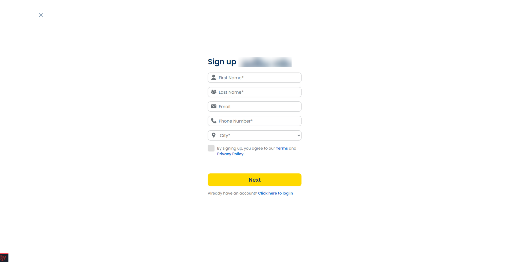

<h3 align="center"> Login & Registration </h3>

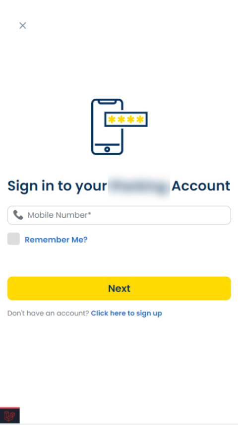
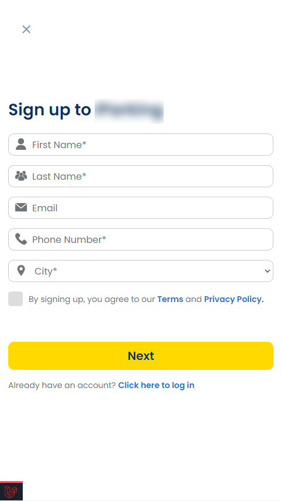

<h3 align="center"> Start View Mobile & Enter OTP </h3>

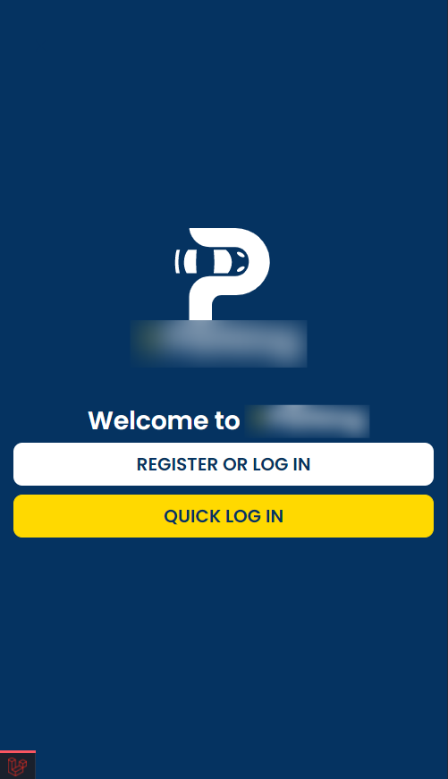
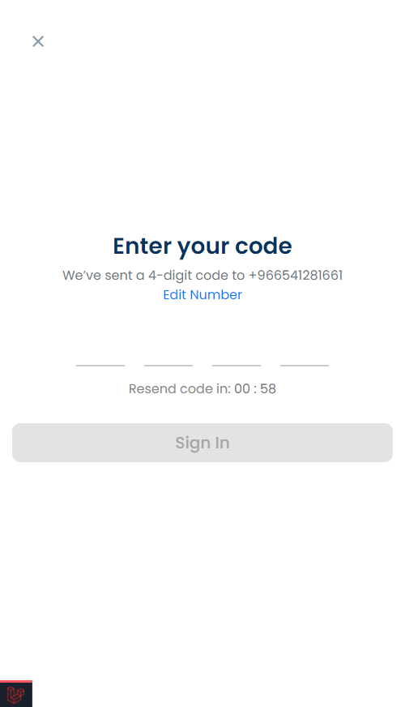

<h3 align="center"> Home & Sidenav </h3>

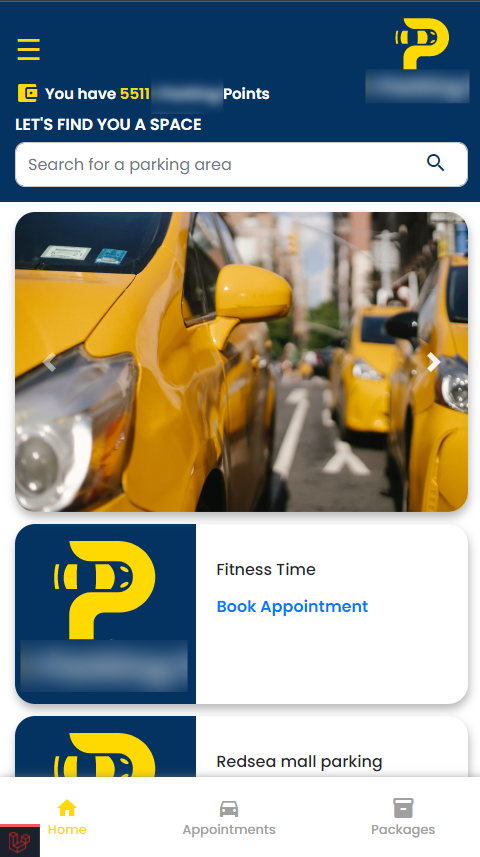
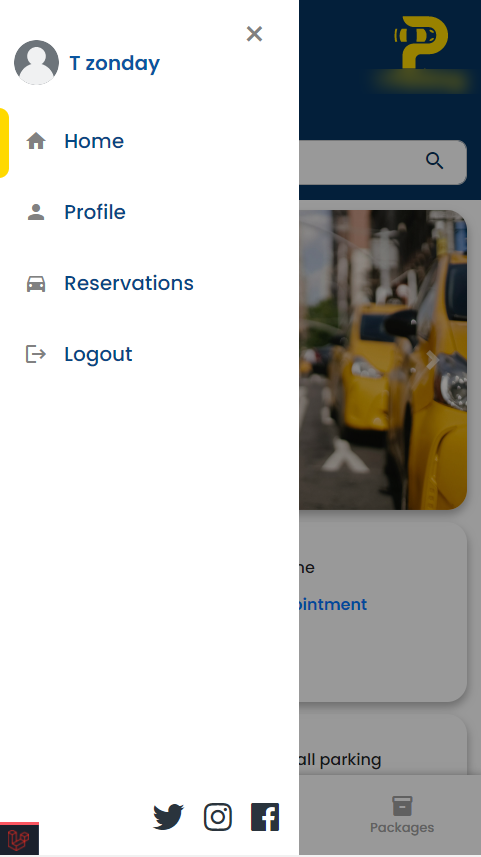

<h3 align="center"> Make an Appointment & Payment </h3>

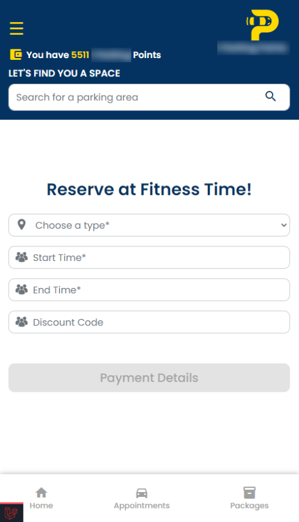
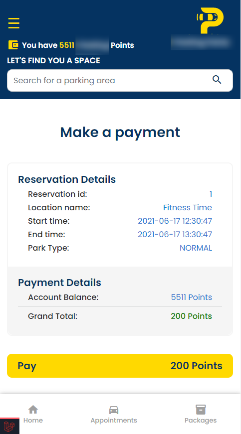

<h3 align="center"> Success & Point Packages </h3>

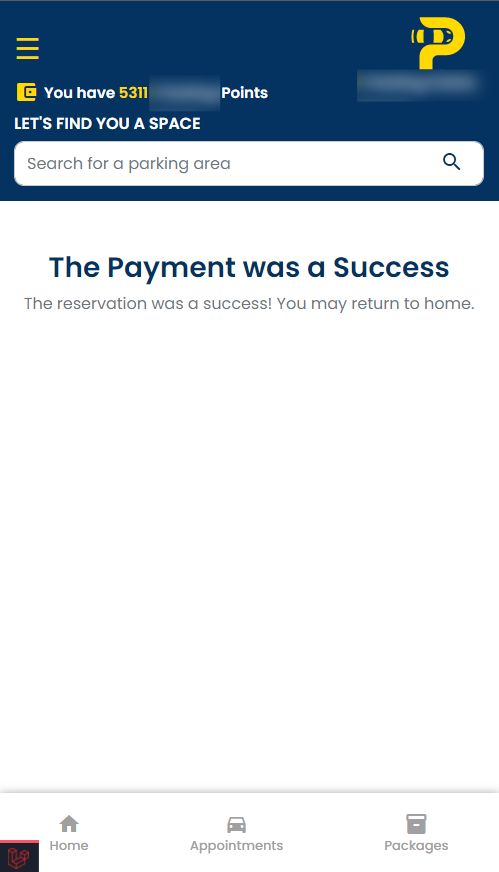
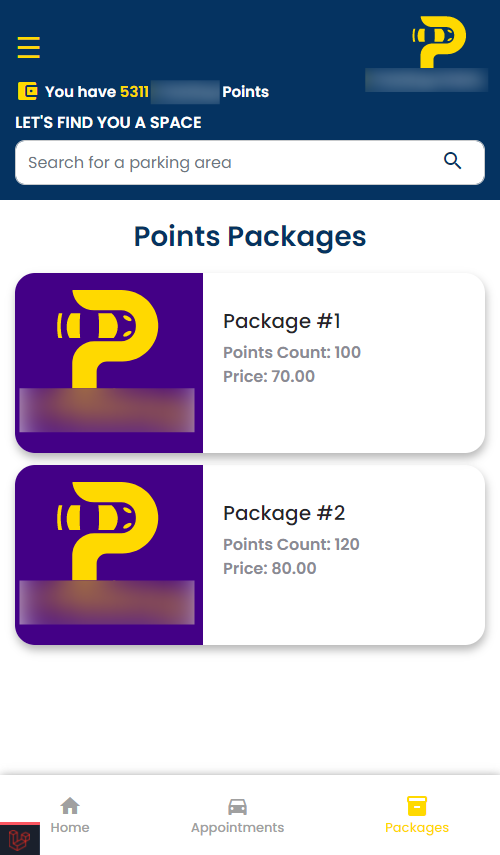

